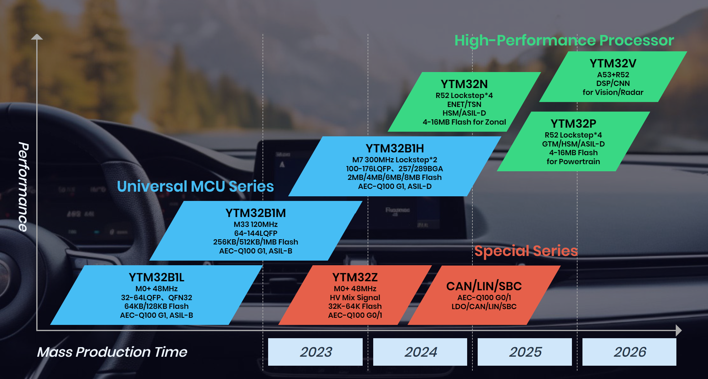

# YTMicro-overview
Overview of YTMicro Electronics: MCU product families, datasheets, application notes, and links to development tools.
# YTMicro Electronics

Welcome to the official GitHub of **YTMicro Electronics**.  
We design and manufacture high-performance microcontrollers and embedded solutions.

## 🌐 Company Website
[https://en.ytmicro.com](https://en.ytmicro.com)

---

## 🏢 About YTMicro
Established in July 2020, Jiangsu Yuntu Microelectronics Co., Ltd. (referred to as “YTMicro”) is headquartered in Wuxi, China. It is an automotive chip company focused on the research and development of high-end automotive-grade control MCUs and HPUs, dedicated to becoming a leading enterprise in domestic automotive control chips and providing assurance for the innovation of global intelligent mobility technology.

By establishing a complete automotive integrated circuit design and verification platform, and strictly adhering to AEC-Q100 and ISO-26262 development process systems and technical specifications, YTMicro has successfully developed multiple automotive-grade MCU chips and dedicated SoC chips with independent intellectual property rights, covering over 90% of application scenarios in the five major domains of a vehicle. Currently, YTMicro has obtained multiple relevant technology patents, with performance indicators ranking at the top of the industry.

---

## 🛠️ Product Families
- **Product Roadmap**
  - This is the product roadmap of YTMicro：  
  

- **L Series Microcontrollers**
  - YTM32B1L automotive-grade microcontroller integrates embedded Flash with a mixed-signal manufacturing process and follows strict automotive design flows, ensuring robust analog and I/O performance with high reliability. Its self-developed capacitor-free LDO circuit design supports any capacitive load, delivering high stability, excellent transient response, ultra-low quiescent current, and a compact structure. An automotive-compliant SDK and reference designs further reduce integration effort and migration risk.
  - The device operates from -40°C to 125°C at 48 MHz, with 128 KB embedded Flash, ESD HBM protection above 4000 V, 1–2 CAN FD interfaces, and over 99.5% scan-chain test coverage. Certified to AEC-Q100, it has also achieved one granted IC layout design right and six software copyrights. The series is already in production and deployed in applications such as sensor control, body motors, TPMS, seating, electric tailgates, sunroofs, and lighting systems.
  - For more information, please visit [Product Details](https://en.ytmicro.com/product-1.php)  

- **M Series Microcontrollers**
  - YTM32B1M automotive-grade microcontrollers is based on the ARM Cortex-M33 core with ARMv8-M Mainline architecture, integrating TrustZone security features to support embedded and IoT applications requiring strong security and digital signal control. The design employs advanced MMMC timing analysis for deep submicron processes, considering PVT/RC/Mode combinations in static timing analysis to accelerate timing closure and shorten design cycles. In addition, software separation technology implemented on Cortex-M33 ensures strict code isolation, reducing certified code volume while enabling deterministic performance and fast context switching for real-time systems.
  - Built on a leading 40nm e-Flash process, the devices feature a 32-bit Cortex-M33 CPU running up to 120 MHz across the full automotive temperature range, with 1 MB embedded Flash and 128 KB ECC-capable SRAM. They meet ISO 26262 ASIL-B functional safety requirements and AEC-Q100 Grade 1 reliability standards. Security support includes AES, SHA, SM4 cryptographic algorithms, and AUTOSAR-compliant MCAL. Optimizations in CPU, bus, security system, and functional safety mechanisms are combined with low-power design techniques, dynamically adjusting cell usage to balance performance and power consumption.
  - Key specifications include 120 MHz frequency, 1 MB Flash, 128 KB ECC SRAM, 16-channel DMA, dual 12-bit ADCs at 2 Msps, high-speed I/O supporting 2.97–5.5 V, and -40°C to 125°C operating range. The series has been granted nine invention patents across LDO design, communication protocols, task scheduling, random number generation, current compensation, ADC enhancements, and Flash control methods. It has passed AEC-Q100 certification, with the YTM32B1LE series additionally certified to ISO 26262 ASIL-B. With shipments exceeding one million units, the products are deployed in BCMs, T-Boxes, automotive CAN gateways, mid-range BMS, lighting controllers, door modules, PEPS, central infotainment systems, virtual instrument clusters, OBCs, thermal management, emission systems, EPS, brake-by-wire, adaptive headlights, camera controllers, HUDs, charging piles, DC/DC converters, and PDUs—providing a full domestic alternative to comparable international products.
  - For more details, please visit [Product Details](https://en.ytmicro.com/product-1.php)  

- **H Series Microcontrollers**
  - YTM32B1H automotive-grade microcontrollers is based on the ARM Cortex-M7 (ARMv7-M) architecture, featuring a six-stage, in-order, dual-issue superscalar pipeline with single- and double-precision FPU, instruction and data cache, branch prediction, SIMD support, tightly coupled memory, and dual-core lockstep capability. These features make it suitable for safety-critical and high-performance applications. The devices adopt dual-voltage domain I/O design for flexible configuration of high- and low-speed I/Os, simplifying system integration. In addition, an independent on-chip safety module is included for fault detection, collection, and reporting, enabling graded safety responses to enhance reliability.
  - Fabricated on an advanced 40 nm e-Flash process, the series runs up to 240 MHz across the full automotive temperature range, achieving high performance without LVT cells, which reduces leakage current and eases physical implementation. The MCU provides 4 MB PFlash, 256 KB DFlash, 768 KB OCRAM, 32×2 KB ITRM, and 128×2 KB DTCM, all with ECC support. It also integrates 8 KB I-Cache, 8 KB D-Cache, 32-channel lockstep DMA, dual 12-bit 2 Msps ADCs with auto-calibration and sequence injection, 100M Ethernet with TSN, 8-bit QSPI at 100 Mbps, dual SAI interfaces, and wide-range high-speed I/Os (2.97–5.5 V). The series meets ISO 26262 ASIL-D safety requirements, AEC-Q100 Grade 1 reliability, and provides an EVITA FULL-compliant HSM, with support for AES, SHA, and SM4 cryptographic algorithms, along with AUTOSAR-compliant MCAL.
  - The product line has been granted three patents (including timing control, adaptive reset with frequency adjustment, and LDO stability enhancement), with additional patents under application in LDO compensation, functional safety fault handling, and multi-process Flash controller design. It is targeted at applications such as VCU vehicle controllers, BMS battery management, BDC body domain controllers, entry-level ZCUs, EPS electric power steering, ABS, ASR, ESP, EBD, EPB, EGR systems, ADB intelligent matrix headlights, AR-HUD, and smart cockpit MCUs.
  - For more details, please visit [Product Details](https://en.ytmicro.com/product-1.php)  
- **Z Series Microcontrollers**
  -  YTM32Z1M automotive-grade MCU series is a highly integrated single-chip solution that combines a high-voltage LDO, motor pre-driver or motor driver, LIN physical layer controller, and microcontroller, enabling complete small-node automotive applications with a single device. It incorporates proprietary zero-crossing detection technology, supporting both single- and multi-shunt motor control schemes, as well as an optimized FOC algorithm embedded in ROM, leveraging efficient coordination of CPU, PWM, pre-driver/driver, ADC sampling, and zero-crossing detection hardware resources. In addition, the series features LIN slave node automatic address assignment using a bus shunt mode method to simplify integration and expand use cases. A dynamically configurable LED driver (30/48/60 mA) further broadens application coverage.
  -  Built on an ARM Cortex-M0+ core, the devices run up to 56 MHz and integrate 48/64 KB Flash memory, a high-voltage LDO, motor pre-driver (up to 100 W) or driver (5 W/15 W), a LIN physical layer controller, and a 48 mA LED driver. They operate across -40°C to 125°C, feature >4000 V ESD HBM protection, and achieve >99.5% scan-chain test coverage. These optimizations enhance ease of use, safety, and reliability while reducing system cost.
  -  The product line has been granted three patents—including zero-crossing detection circuits for BLDC motors, a low-power automotive-grade LDO with sink capability, and a multi-sequence SAR-ADC conversion method—and has three additional patents under application covering configurable multi-channel ADC, memory fault detection/repair, and abnormal pin state detection in automotive chips.
  - For more details, please visit [Product Details](https://en.ytmicro.com/product-1.php)  

---
## 🚀 Getting Started
If you’re a developer exploring YTMicro products:
1. Visit our [official developing-ecosystem](https://account.ytmicro.com/). In our ecosystem, you can find everything you need, including developing tools, datasheets, and application examples for every product.
2. Carefully read the tutorials for beginners
3. Explore our upcoming GitHub repositories (examples, drivers, SDKs).
---
## 📚 Developer Resources
- [Datasheets & Technical Docs](https://en.ytmicro.com/index.php?ac=article&at=list&tid=19)  
- [Application Notes](https://en.ytmicro.com/index.php?ac=article&at=list&tid=20)  
- [Development Tools](https://en.ytmicro.com/index.php?ac=article&at=list&tid=22)  
---

## 📬 Contact
- Website: [ytmicro.com](https://en.ytmicro.com)  
- Email: <support@ytmicro.com>
- Email: <contact@ytmicro.com>      
  
